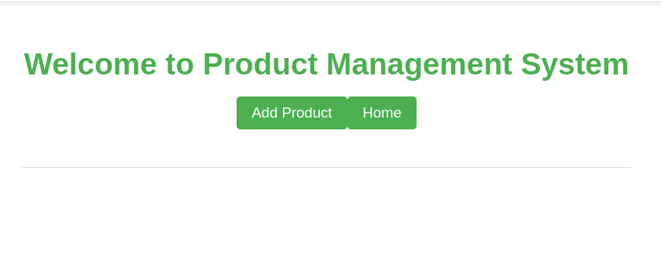
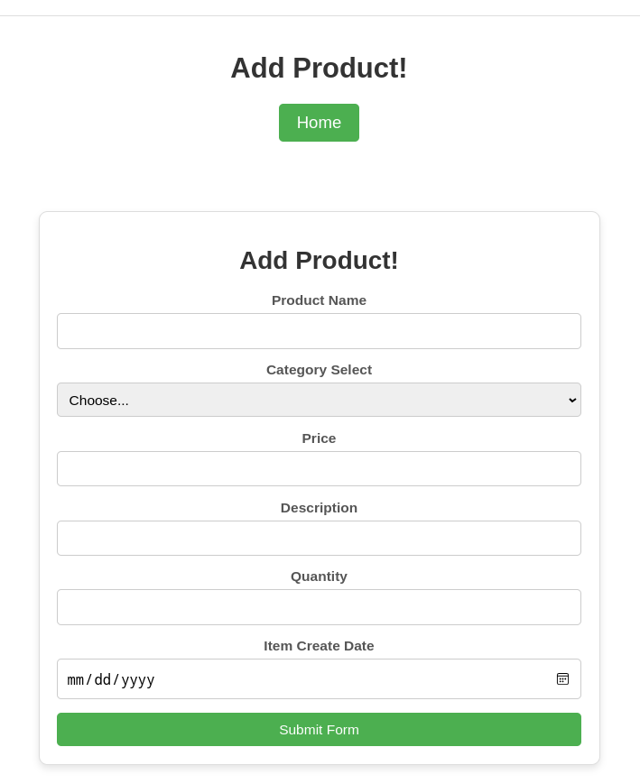
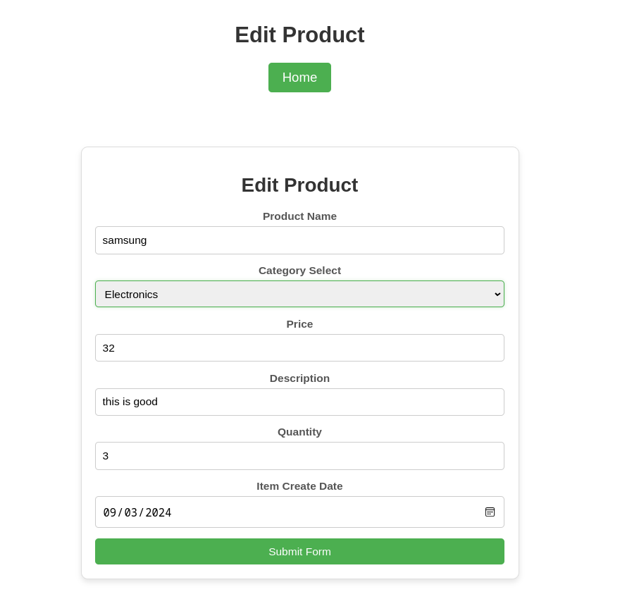
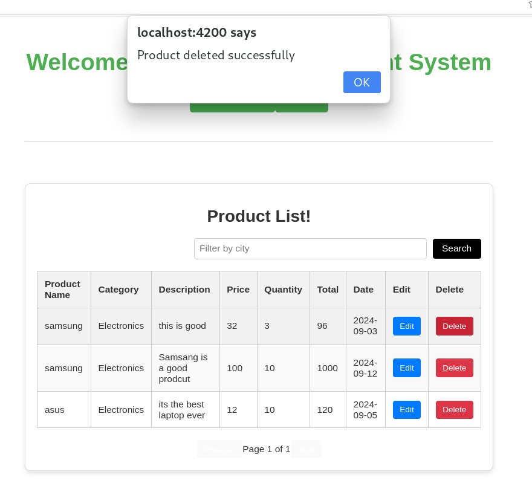
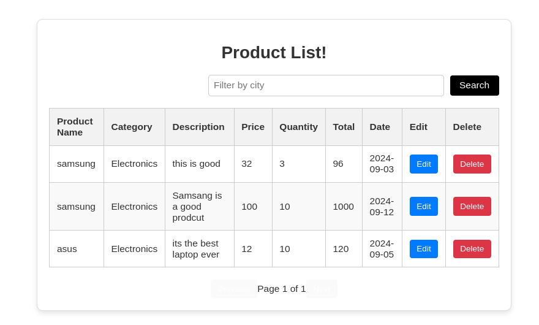
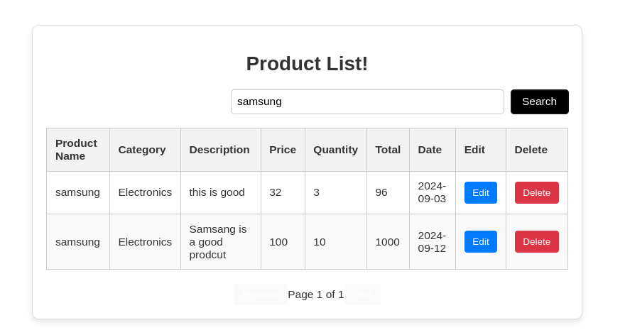

# Product-Management
## Angular Project Setup and Installation Guide

This guide provides step-by-step instructions to set up and run an Angular project using the latest version of Angular.

## Installing Angular CLI

```
npm install -g @angular/cli
```

## Create project folder and Initialize angular
```
ng new Project-Management
```
## To Serve Angular Project
```
ng serve -o
```
## Here All the dependencys and packages I have used for this project and version
```
Angular CLI: 18.2.2
Node: 20.12.2
Package Manager: npm 10.5.0
OS: linux x64
Angular: 18.2.2
Package                         Version
---------------------------------------------------------
@angular-devkit/architect       0.1802.2
@angular-devkit/build-angular   18.2.2
@angular-devkit/core            18.2.2
@angular-devkit/schematics      18.2.2
@schematics/angular             18.2.2
rxjs                            7.8.1
typescript                      5.5.4
zone.js                         0.14.10
```
## Some Features of My Project

<h1 align="center">This is the Initial Page. When the Project Runs</h1>

<p align="center">
  
</p>

<h1 align="center">Add New Product Page</h1>

<p align="center">
  
</p>

<h1 align="center">Edit the Existing Product</h1>

<p align="center">
  
</p>

<h1 align="center">Alert After Adding a New Product</h1>

<p align="center">
  
</p>

<h1 align="center">Deleted Product</h1>

<p align="center">
  
</p>

<h1 align="center">Product List Page</h1>

<p align="center">
  
</p>

<h1 align="center">Search by Product List</h1>

<p align="center">
  
</p>
