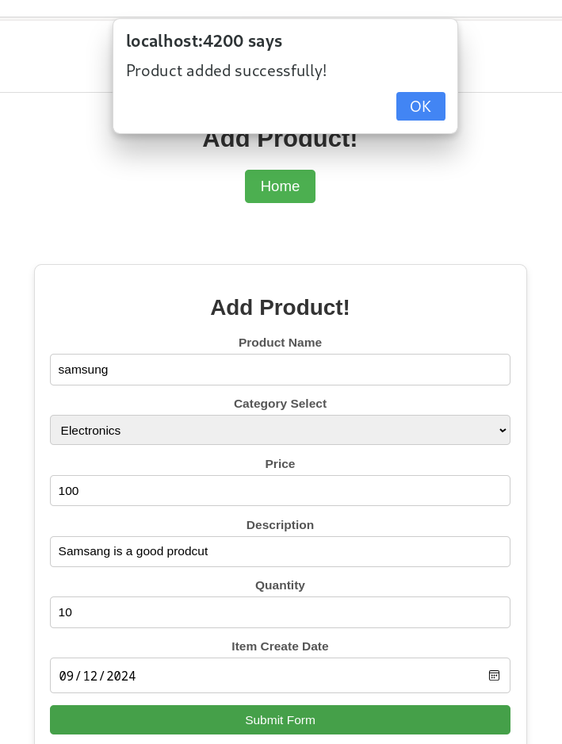

# Product-Management
## Angular Project Setup and Installation Guide

This guide provides step-by-step instructions to set up and run an Angular project using the latest version of Angular.

## Prerequisites

Before you begin, ensure you have the following installed:

- **Node.js**: Download and install the latest LTS version from [Node.js official website](https://nodejs.org/).
- **npm**: Node.js comes with npm (Node Package Manager).

To verify that Node.js and npm are installed, run the following commands in your terminal:

```bash
node -v
npm -v
```
## Installing Angular CLI

```
npm install -g @angular/cli
```

## Create project folder and Initialize angular
```
ng new Project-Management
```
## To Serve Angular Project
```
ng serve -o
```
## Here All the dependencys and packages I have used for this project and version
```
Angular CLI: 18.2.2
Node: 20.12.2
Package Manager: npm 10.5.0
OS: linux x64

Angular: 18.2.2
... animations, cli, common, compiler, compiler-cli, core, forms
... platform-browser, platform-browser-dynamic, platform-server
... router, ssr

Package                         Version
---------------------------------------------------------
@angular-devkit/architect       0.1802.2
@angular-devkit/build-angular   18.2.2
@angular-devkit/core            18.2.2
@angular-devkit/schematics      18.2.2
@schematics/angular             18.2.2
rxjs                            7.8.1
typescript                      5.5.4
zone.js                         0.14.10
```

## Some Feature of my Project

<h1 align="center">This is the Initial Page. When Project run</h1>


<h1 align="center">Add new Product page</h1>


<h1 align="center">Edit the existing product</h1>


<h1 align="center">Alert After adding new Product</h1>


<h1 align="center">Deleted Product</h1>


<h1 align="center">Product List Page</h1>


<h1 align="center">Search By product List</h1>


